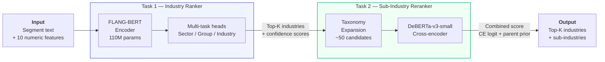
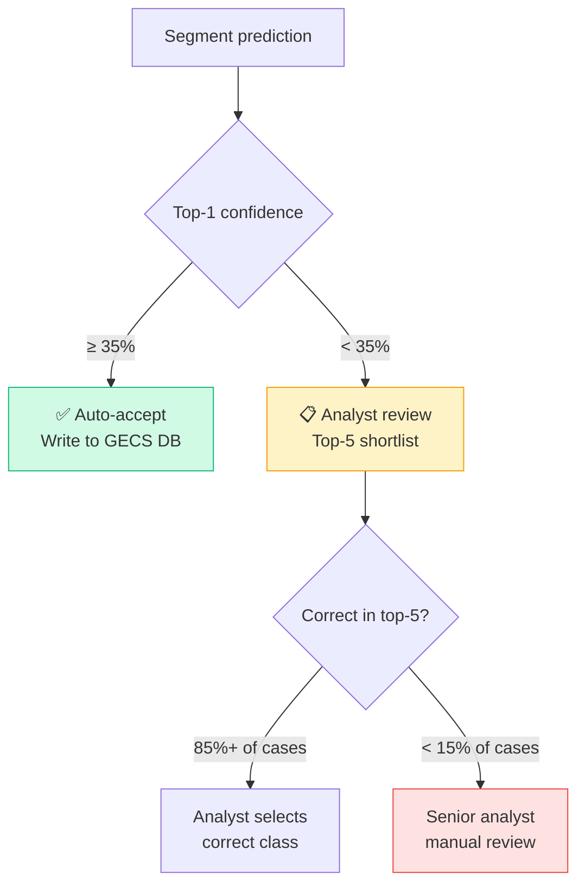
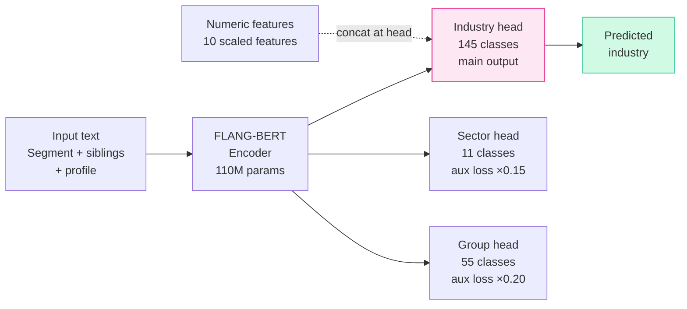
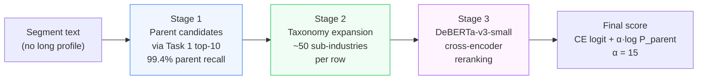

<div align="center">

# 🏦 GECS Industry & Sub-Industry Predictor

**ML system for automating Morningstar's Global Equity Classification Standard (GECS)**

*DePaul University × Morningstar | MGT 599 Business Analytics Capstone | Group 7 | Spring 2026*

[](https://python.org)
[](https://fastapi.tiangolo.com)
[](https://pytorch.org)
[](https://huggingface.co)
[](LICENSE)

</div>

---

## 📋 Overview

Morningstar's Reference Entity Data (RED) team manually classifies 53,000+ company segments into the GECS hierarchy — a process that doesn't scale. This project automates two classification tasks using fine-tuned transformer models, a confidence-based routing layer, and a production REST API.

- **Task 1** — Classify company segments into **145 GECS industries** from SEC 10-K text
- **Task 2** — Classify segments into **374 GECS sub-industries** using a cross-encoder reranker
- **API** — FastAPI with 5 endpoints, validated at sub-100ms latency per record

---

## 🏆 Results

| Task | Metric | Target | Achieved | Status |
|---|---|---|---|---|
| Task 1 — Industry Classification | Macro F1 | ≥ 0.75 | **0.8325** | ✅ |
| Task 1 — Industry Classification | Top-10 Macro F1 | > 0.85 | **0.9311** | ✅ |
| Task 2 — Sub-Industry Classification | Top-10 Macro F1 | > 0.85 | **0.8905** | ✅ |
| Task 2 — Sub-Industry Classification | Top-1 Accuracy | — | **74.9%** | ✅ |
| API — Inference Latency | — | < 100ms | **Sub-100ms** | ✅ |
| Confidence Routing | Top-5 recall (Task 1) | — | **85%+** | ✅ |
| Confidence Routing | Top-5 recall (Task 2) | — | **92.4%** | ✅ |

---

## 🏗️ Architecture

### Full Pipeline



### Confidence-Based Routing



### Task 1 — FLANG-BERT Multi-Task Architecture



### Task 2 — Three-Stage Candidate Pipeline



---

## 🚀 Quickstart

### Prerequisites
- Python 3.12+
- ~4 GB RAM (8 GB recommended)
- ~1.5 GB disk for model weights

### 1. Clone
```bash
git clone https://github.com/meeetppatel/depaul-morningstar-capstone.git
cd depaul-morningstar-capstone
```

### 2. Install
```bash
python -m venv .venv
source .venv/bin/activate
pip install -r serving_app/requirements.txt
```

### 3. Download weights
```bash
# Edit scripts/download_weights.py with Drive file IDs, then:
python scripts/download_weights.py

# Or download manually from Google Drive and place at:
# weights/task1/best_model_state.pt       (418 MB)
# weights/task2/cross_encoder/best_state.pt  (539 MB)
# weights/task2/taxonomy_table.csv
```

### 4. Run
```bash
python -m uvicorn serving_app.fastapi_app:app --host 0.0.0.0 --port 8000
```

Open **http://localhost:8000/** for the interactive UI or **http://localhost:8000/docs** for Swagger.

---

## 🔌 API Reference

| Method | Endpoint | Purpose |
|---|---|---|
| `GET` | `/` | Interactive browser UI |
| `GET` | `/api/health` | Model metadata + device info |
| `GET` | `/api/industries` | All 145 GECS industries (searchable) |
| `GET` | `/api/template.csv` | CSV upload template |
| `POST` | `/api/predict` | Full pipeline — industry + sub-industry |
| `POST` | `/api/predict_industry` | Task 1 only (145 classes) |
| `POST` | `/api/predict_subindustry` | Task 2 only (374 classes) |
| `POST` | `/api/predict_csv` | CSV batch upload |

### Example Request

```bash
curl -X POST http://localhost:8000/api/predict \
  -H "Content-Type: application/json" \
  -d '{
    "top_k": 5,
    "records": [{
      "CompanyId": "EXAMPLE_001",
      "AsOfDate": "2024-12-31",
      "SegmentName": "Upstream E&P",
      "SegmentDescription": "Exploration and production of crude oil and natural gas from Permian Basin assets.",
      "LongProfile": "Independent oil and gas E&P company with operations in West Texas.",
      "Revenue": 4200,
      "total_revenue_company_as_of": 4200,
      "revenue_share": 1.0,
      "is_largest_share_segment": true
    }]
  }'
```

### Example Response

```json
{
  "task": "both",
  "results": [{
    "segment_name": "Upstream E&P",
    "company_id": "EXAMPLE_001",
    "confidence_flag": "high",
    "recommendation": "auto_accept",
    "industry_candidates": [
      {"rank": 1, "industry_code": "30910020", "industry_name": "Oil & Gas E&P", "confidence": 0.938}
    ],
    "subindustry_candidates": [
      {"rank": 1, "subindustry_code": "3091002001", "subindustry_name": "Oil Exploration and Production", "confidence": 1.0}
    ]
  }]
}
```

---

## 📁 Repository Structure

```
depaul-morningstar-capstone/
│
├── 📓 notebooks/
│   ├── 01_cleaning_v10.ipynb              # Final data cleaning pipeline
│   ├── 02_eda.ipynb                       # Exploratory data analysis
│   ├── 02_baseline_v9.ipynb               # TF-IDF + LinearSVC baseline
│   ├── 03_flangbert_v10_colab.ipynb       # FLANG-BERT v10 training
│   ├── 06_flang_deberta_champion_colab.ipynb  # ⭐ Task 1 champion (0.8325 F1)
│   └── task2_*.ipynb                      # Task 2 experiments
│
├── 🚀 serving_app/
│   ├── fastapi_app.py                     # API endpoints
│   ├── inference.py                       # Full ML pipeline
│   ├── landing.html                       # Browser UI
│   └── requirements.txt
│
├── 🔧 scripts/
│   └── download_weights.py                # Pull weights from Google Drive
│
├── ⚖️ weights/                             # gitignored — download separately
│   ├── task1/                             # FLANG-BERT weights + encoders
│   └── task2/                             # Cross-encoder + taxonomy
│
└── 📖 README.md
```

---

## 🔬 Model Details

<details>
<summary><b>Task 1 — FLANG-BERT Champion</b></summary>

- **Base model:** `SALT-NLP/FLANG-BERT` (110M parameters)
- **Architecture:** Multi-task transformer with three classification heads
  - Leaf head: 145 industries (main objective)
  - Sector head: 11 classes (auxiliary, weight 0.15)
  - Group head: 55 classes (auxiliary, weight 0.20)
- **Numeric features:** 10 engineered features concatenated to BERT pooled output before leaf head (`revenue_share`, `log_revenue`, `herfindahl_index`, `n_segments`, etc.)
- **Training:** 3-phase schedule — 6 epochs CE → 4 epochs Focal (γ=1.0) → 4 epochs CE at reduced LR
- **Input format:** `[] [] [year] [PRIMARY] {SegmentName} [SEP] {SegmentDescription} [SEG rev%] {sibling} [LP] {profile}`
- **Key finding:** Segment-name anchoring and sibling context produced larger F1 gains than encoder scale or loss-function variants

</details>

<details>
<summary><b>Task 2 — DeBERTa-v3-small Cross-Encoder</b></summary>

- **Base model:** `microsoft/deberta-v3-small`
- **Architecture:** Binary classifier on (segment_text, taxonomy_text) pairs
- **Three-stage pipeline:**
  1. Use Task 1 top-10 parents as candidates (99.4% parent recall)
  2. Expand each parent to child sub-industries via GECS taxonomy (~50 candidates/row)
  3. Score each (segment, taxonomy) pair: `score(c) = logit_CE + α · log P_parent(c)`
- **Alpha:** α = 15 (tuned on validation set)
- **Key finding:** Combining cross-encoder with parent prior doubled Top-10 Macro F1 vs cross-encoder alone

</details>

<details>
<summary><b>Data & Training Setup</b></summary>

- **Task 1 dataset:** 53,585 segment records from SEC 10-K filings (2003–2024), 23,207 unique companies
- **Task 2 dataset:** 27,537 records, 374 active sub-industry labels
- **Split:** GroupShuffleSplit by CompanyId (80/20) — prevents company text leakage
- **Task 1 test set:** 10,717 held-out companies
- **Hardware:** MacBook + Google Colab Pro (T4/A100 GPU)
- **Key cleaning decision:** 51.4% of rows had empty SegmentDescription — solved via segment-name anchoring at both ends of LongProfile fallback

</details>

---

## 🌐 Environment Variables

| Variable | Default | Purpose |
|---|---|---|
| `SERVING_DEVICE` | `cpu` | Set to `cuda` if GPU available |
| `SERVING_TASK2_ALPHA` | `15.0` | Parent-prior weight for Task 2 |
| `SERVING_TASK2_BATCH_SIZE` | `4` | Cross-encoder batch size |
| `SERVING_LOCAL_FILES_ONLY` | `0` | Set to `1` to disable HuggingFace downloads |

---

## 👥 Team

| Member | Role | Key Contributions |
|---|---|---|
| **Meet Patel** | Technical Co-Lead — Evaluation & API | FLANG-BERT champion model, FastAPI integration, GitHub version control |
| **Hanane Nekkaz** | Technical Co-Lead — Modeling | Six-stream HGBT ensemble, Task 2 cross-encoder pipeline, model benchmarking |
| **Anas Syed** | Business Research Lead | GECS taxonomy research, serving app UI ([see repo](https://github.com/anane097-coder/Company-GECS-Activity-Predictor)) |
| **Saumyaa Kannan** | Project Manager | Timeline governance, stakeholder alignment, proposal |
| **Dev Gauravbhai Patel** | Visualization Lead | Tableau dashboards, Gantt chart, presentation design |

> Repository and version control maintained by Meet Patel.
> Task 2 model and browser UI originally developed by Anas Syed.

---

## 📚 References

- Shah et al. (2022). [FLANG: A Financial Language Model and Benchmark](https://arxiv.org/abs/2211.00083)
- He et al. (2021). [DeBERTa: Decoding-enhanced BERT with Disentangled Attention](https://openreview.net/forum?id=XPZIaotutsD)
- Devlin et al. (2019). [BERT: Pre-training of Deep Bidirectional Transformers](https://doi.org/10.18653/v1/N19-1423)
- Oord et al. (2018). [Representation Learning with Contrastive Predictive Coding](https://arxiv.org/abs/1807.03748)

---

<div align="center">
<sub>DePaul University × Morningstar | MGT 599 Capstone | Spring 2026</sub>
</div>
