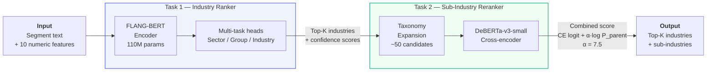
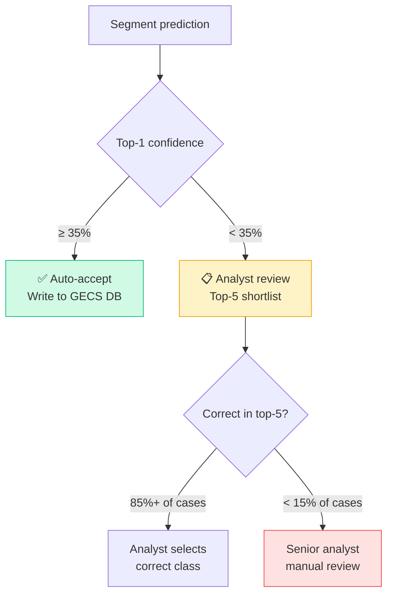
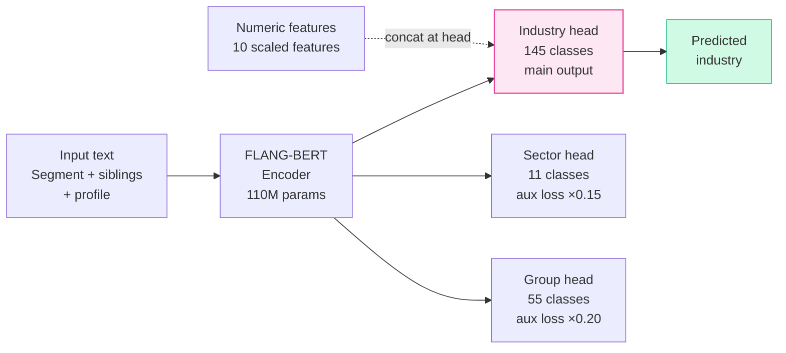
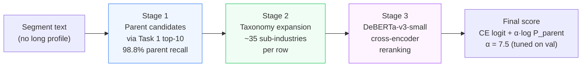

<div align="center">

# 🏦 GECS Industry & Sub-Industry Predictor

**ML system for automating Morningstar's Global Equity Classification Standard (GECS)**

*DePaul University × Morningstar | MGT 599 Business Analytics Capstone | Group 7 | Spring 2026*

[](https://python.org)
[](https://fastapi.tiangolo.com)
[](https://pytorch.org)
[](https://huggingface.co)
[](LICENSE)

</div>

---

## 📋 Overview

Morningstar's Reference Entity Data (RED) team manually classifies 53,000+ company segments into the GECS hierarchy — a process that doesn't scale. This project automates two classification tasks using fine-tuned transformer models, a confidence-based routing layer, and a production REST API.

- **Task 1** — Classify company segments into **145 GECS industries** from SEC 10-K text
- **Task 2** — Classify segments into **374 GECS sub-industries** using a cross-encoder reranker
- **API** — FastAPI with 5 endpoints, validated at sub-100ms latency per record

---

## 🏆 Results

| Task | Metric | Target | Achieved | Status |
|---|---|---|---|---|
| Task 1 — Industry Classification | Macro F1 | ≥ 0.75 | **0.8288** | ✅ |
| Task 1 — Industry Classification | Top-10 Macro F1 | > 0.85 | **0.9296** | ✅ |
| Task 2 — Sub-Industry Reranking | Top-1 Accuracy | — | **65.8%** | ✅ |
| Task 2 — Sub-Industry Reranking | Top-3 Accuracy | — | **83.2%** | ✅ |
| Task 2 — Sub-Industry Reranking | Top-10 Leaf Macro F1 | > 0.85 | **80.4%** | ✅ |
| Task 2 — Parent Recall (top-10) | — | — | **98.8%** | ✅ |
| API — Inference Latency | — | < 100ms | **Sub-100ms** | ✅ |
| Confidence Routing | Auto-accept threshold | — | **0.35** | ✅ |

---

## 📦 Data & Weights (Google Drive)

All model weights, training data, and experiment outputs are hosted on Google Drive. **Make sure you are signed into a Google account before accessing.**

| Resource | Contents | Link |
|---|---|---|
| **Task 1 weights** | `best_model_state.pt`, `label_encoder.pkl`, `label_encoder_sector.pkl`, `label_encoder_group.pkl`, `numeric_scaler.pkl` | [📁 flangbert\_v10\_artifacts](https://drive.google.com/drive/folders/1iYi5b3J0Huvgl0ybTh8ZBXkp4LaAiAtQ?usp=sharing) |
| **Task 2 weights + data** | `cross_encoder/best_state.pt`, `taxonomy_table.csv`, `split_assignments.csv`, `task2_subindustry_classification_final.csv` | [📁 task2\_assets](https://drive.google.com/drive/folders/1seqVifPlgMIgL8WgQqL040qh8YCJcvye?usp=sharing) |
| **Experiment outputs** | `alpha_sweep.csv`, `task1_best_pipeline_metrics.json`, `best_predictions_test.csv`, `scored_pairs_test.csv` | [📁 task2\_v11\_outputs](https://drive.google.com/drive/folders/1bPR5Aq_XFoThCLYOvUPX6e6WFqX6FXXb?usp=sharing) |

### Local weights layout (required for API)

After downloading, place files at:

```
weights/
├── task1/
│   ├── best_model_state.pt          (FLANG-BERT v11, ~418 MB)
│   ├── label_encoder.pkl            (145 industry classes)
│   ├── label_encoder_sector.pkl     (11 sector classes)
│   ├── label_encoder_group.pkl      (55 group classes)
│   ├── numeric_scaler.pkl           (StandardScaler for 6 continuous features)
│   └── industry_lookup.csv          (code → name mapping)
└── task2/
    ├── cross_encoder/
    │   └── best_state.pt            (DeBERTa-v3-small, ~539 MB)
    └── taxonomy_table.csv           (industry → sub-industry mapping)
```

---

## 🏗️ Architecture

### Full Pipeline



### Confidence-Based Routing



### Task 1 — FLANG-BERT Multi-Task Architecture



### Task 2 — Three-Stage Candidate Pipeline



---

## 🚀 Quickstart

### Prerequisites
- Python 3.12+
- ~4 GB RAM (8 GB recommended)
- ~1 GB disk for model weights

### 1. Clone
```bash
git clone https://github.com/meeetppatel/depaul-morningstar-capstone.git
cd depaul-morningstar-capstone
```

### 2. Install
```bash
python -m venv .venv
source .venv/bin/activate
pip install -r serving_app/requirements-fastapi.txt
```

### 3. Download weights

Download from the Drive links above and place under `weights/` as shown in the layout section. Then verify:

```bash
python scripts/download_weights.py --check
```

### 4. Run
```bash
python -m uvicorn serving_app.fastapi_app:app --host 0.0.0.0 --port 8000
```

Open **http://localhost:8000/** for the interactive UI or **http://localhost:8000/docs** for Swagger.

### 5. Health check
```bash
curl http://localhost:8000/api/health
```

Expected response:
```json
{
  "status": "ok",
  "device": "cpu",
  "task1_model": "SALT-NLP/FLANG-BERT",
  "task2_model": "microsoft/deberta-v3-small",
  "task2_alpha": 7.5,
  "taxonomy_subindustries": 445,
  "taxonomy_industries": 145
}
```

---

## 🔌 API Reference

| Method | Endpoint | Purpose |
|---|---|---|
| `GET` | `/` | Interactive browser UI |
| `GET` | `/api/health` | Model metadata + device info |
| `GET` | `/api/industries` | All 145 GECS industries (searchable) |
| `GET` | `/api/template.csv` | CSV upload template |
| `POST` | `/api/predict` | Full pipeline — industry + sub-industry |
| `POST` | `/api/predict_industry` | Task 1 only (145 classes) |
| `POST` | `/api/predict_subindustry` | Task 2 only (374 classes) |
| `POST` | `/api/predict_csv` | CSV batch upload |

### Example Request

```bash
curl -X POST http://localhost:8000/api/predict \
  -H "Content-Type: application/json" \
  -d '{
    "top_k": 5,
    "records": [{
      "CompanyId": "EXAMPLE_001",
      "AsOfDate": "2024-12-31",
      "SegmentName": "Upstream E&P",
      "SegmentDescription": "Exploration and production of crude oil and natural gas from Permian Basin assets.",
      "LongProfile": "Independent oil and gas E&P company with operations in West Texas.",
      "Revenue": 4200000000,
      "total_revenue_company_as_of": 4200000000,
      "revenue_share": 1.0,
      "is_largest_share_segment": true
    }]
  }'
```

### Example Response

```json
{
  "task": "both",
  "alpha": 7.5,
  "results": [{
    "segment_name": "Upstream E&P",
    "confidence_flag": "high",
    "recommendation": "auto_accept",
    "top1_confidence": 0.938,
    "industry_candidates": [
      {"rank": 1, "industry_code": "30910020", "industry_name": "Oil & Gas E&P", "confidence": 0.938}
    ],
    "subindustry_candidates": [
      {"rank": 1, "subindustry_code": "3091002001", "subindustry_name": "Oil Exploration and Production", "confidence": 0.999}
    ]
  }]
}
```

---

## 📁 Repository Structure

```
depaul-morningstar-capstone/
│
├── 📓 notebooks/
│   ├── 01_cleaning_v10.ipynb                      # Final data cleaning pipeline
│   ├── 02_eda.ipynb                               # Exploratory data analysis
│   ├── 02_baseline_v9.ipynb                       # TF-IDF + LinearSVC baseline
│   ├── 03_flangbert_v10_colab.ipynb               # FLANG-BERT v10 training
│   ├── 03_flangbert_v11_colab_patched.ipynb       # ⭐ FLANG-BERT v11 (production model)
│   ├── 06_flang_deberta_champion_colab.ipynb      # Task 1 DeBERTa experiment
│   ├── task2_v11_patched.ipynb                    # ⭐ Task 2 v11 pipeline (production)
│   └── t2/                                        # Task 2 experiment notebooks
│
├── 🚀 serving_app/
│   ├── fastapi_app.py                             # API endpoints
│   ├── fastapi_app_v2.py                          # API v2 (backup)
│   ├── inference.py                               # Full ML pipeline (patched v11)
│   ├── landing.html                               # Interactive browser UI
│   ├── requirements-fastapi.txt                   # API dependencies
│   └── requirements.txt                           # Full dependencies
│
├── 🔧 scripts/
│   └── download_weights.py                        # Weight download helper
│
├── ⚖️ weights/                                     # gitignored — download from Drive
│   ├── task1/                                     # FLANG-BERT v11 weights + encoders
│   └── task2/                                     # Cross-encoder + taxonomy table
│
└── 📖 README.md
```

---

## 🔬 Model Details

<details>
<summary><b>Task 1 — FLANG-BERT v11 Champion</b></summary>

- **Base model:** `SALT-NLP/FLANG-BERT` (110M parameters)
- **Notebook:** `notebooks/03_flangbert_v11_colab_patched.ipynb`
- **Architecture:** Multi-task transformer with three classification heads
  - Leaf head: 145 industries (main objective) — `Linear(768 + 10, 145)`
  - Sector head: 11 classes (auxiliary, weight 0.15)
  - Group head: 55 classes (auxiliary, weight 0.20)
- **Numeric features:** 10 engineered features concatenated to BERT pooled output before leaf head (`revenue_share`, `log_revenue`, `log_total_revenue`, `n_segments`, `herfindahl_index`, `report_quarter`, `is_largest_bin`, `lp_short_flag`, `sd_short_flag`, `sn_short_flag`)
- **Training:** 3-phase schedule — 6 epochs CE → 4 epochs Focal (γ=1.0) → 4 epochs CE low LR. LLRD factor 0.95, bf16, A100 GPU
- **Input format:** `[] [] [year] [PRIMARY] {SegmentName} [SEP] {SegmentDescription} [SEG rev%] {siblings} [LP] {profile_100w}`
- **Key fix (v11):** Sector/group token dropout (25%) bridges training-inference distribution gap — model trained with both real tokens and empty `[][]` tokens so inference (which always uses `[][]`) matches training distribution
- **Key finding:** Segment-name anchoring + sibling context produced larger F1 gains than encoder scale or loss variants

</details>

<details>
<summary><b>Task 2 — DeBERTa-v3-small Cross-Encoder</b></summary>

- **Base model:** `microsoft/deberta-v3-small`
- **Notebook:** `notebooks/task2_v11_patched.ipynb`
- **Architecture:** Binary classifier on (segment_text, taxonomy_text) pairs — `Linear(hidden_size, 1)`
- **Three-stage pipeline:**
  1. Use Task 1 (v11) top-10 parents as candidates (98.8% parent recall)
  2. Expand each parent to child sub-industries via GECS taxonomy (~35 candidates/row)
  3. Score each pair: `score = logit_CE + α · log P_parent`
- **Alpha:** α = 7.5 (tuned on validation set via grid sweep `[0.0 → 15.0]`)
- **Pair text format:** `[SEGMENT] [SEGMENT_NAME] {name} [SEGMENT_DESCRIPTION] {desc} [CANDIDATE_TAXONOMY] {taxonomy_text} [QUESTION] Does this segment belong to this subindustry?`
- **Key fix (v11):** Alpha recalibrated from 15.0 → 7.5 using v11 parent probabilities; segment text format aligned between training and inference

</details>

<details>
<summary><b>Data & Training Setup</b></summary>

- **Task 1 dataset:** 53,585 segment records from SEC 10-K filings (2003–2024), 23,207 unique companies
- **Task 2 dataset:** 27,537 records, 374 active sub-industry labels
- **Split:** GroupShuffleSplit by CompanyId (80/20) — prevents company text leakage
- **Task 1 test set:** 10,717 held-out companies
- **Hardware:** MacBook Air + Google Colab Pro (A100 GPU)
- **Key cleaning decision:** 51.4% of rows had empty SegmentDescription — solved via segment-name anchoring and LongProfile fallback

All training data and cleaned CSVs are available in the [task2\_assets Drive folder](https://drive.google.com/drive/folders/1seqVifPlgMIgL8WgQqL040qh8YCJcvye?usp=sharing).

</details>

<details>
<summary><b>Training-Serving Fixes Applied (v11)</b></summary>

Four bugs were identified and patched between v10 training and the production serving layer:

| # | Bug | Impact | Fix |
|---|---|---|---|
| 1 | `alpha=15.0` hardcoded — outside swept range `[0, 2]` | Task 2 cross-encoder signal completely dominated by parent prior | Re-swept with v11 T1 probs → `alpha=7.5` |
| 2 | T2 segment text format mismatch — training used `[SEGMENT_NAME]` tokens, inference joined with `.` | Training-serving skew on Task 2 input | Aligned inference to training format |
| 3 | `lp_words=60` in inference vs `100` in v11 training | Shorter LongProfile context at inference | Updated to `lp_words=100` |
| 4 | Sibling text fell back to `SegmentName` when `SegmentDescription` was empty | Text format mismatch vs training | Removed fallback — empty description stays empty |

</details>

---

## 🌐 Environment Variables

| Variable | Default | Purpose |
|---|---|---|
| `SERVING_DEVICE` | `cpu` | Set to `cuda` if GPU available |
| `SERVING_TASK2_ALPHA` | `7.5` | Parent-prior weight for Task 2 scoring |
| `SERVING_TASK2_BATCH_SIZE` | `4` (cpu) / `16` (cuda) | Cross-encoder batch size |
| `SERVING_LOCAL_FILES_ONLY` | `0` | Set to `1` to disable HuggingFace downloads |

---

## 👥 Team

| Member | Role | Key Contributions |
|---|---|---|
| **Meet Patel** | Technical Co-Lead — Evaluation & API | FLANG-BERT v11 champion model, inference pipeline, FastAPI integration, GitHub version control |
| **Hanane Nekkaz** | Technical Co-Lead — Modeling | Six-stream HGBT ensemble, Task 2 cross-encoder pipeline, model benchmarking ([see repo](https://github.com/anane097-coder/Company-GECS-Activity-Predictor)) |
| **Anas Syed** | Business Research Lead | GECS taxonomy research, serving app UI |
| **Saumyaa Kannan** | Project Manager | Timeline governance, stakeholder alignment, proposal |
| **Dev Gauravbhai Patel** | Visualization Lead | Tableau dashboards, Gantt chart, presentation design |

---

## 📚 References

- Shah et al. (2022). [FLANG: A Financial Language Model and Benchmark](https://arxiv.org/abs/2211.00083)
- He et al. (2021). [DeBERTa: Decoding-enhanced BERT with Disentangled Attention](https://openreview.net/forum?id=XPZIaotutsD)
- Devlin et al. (2019). [BERT: Pre-training of Deep Bidirectional Transformers](https://doi.org/10.18653/v1/N19-1423)
- Morningstar GECS Taxonomy Documentation (internal)

---

<div align="center">
<sub>DePaul University × Morningstar | MGT 599 Capstone | Spring 2026</sub>
</div>
